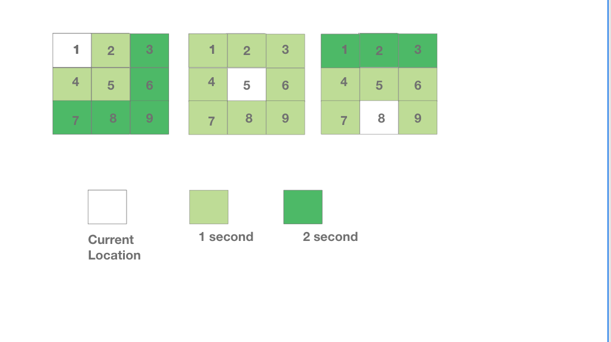

## Problem Description

In order to enter the building, Employees of an Enterprise security provider company have to type a passcode into console using _3 X 3_ numeric keypad. Every day, the numbers on the keypad are mixed up.

Use the following rules to calculate the total amount of time it takes to type a passcode:

- It takes 0 seconds to move their finger to the first key, and it takes 0 seconds to press the key where their finger is located any number of times.
- They can move their finger from one location to any adjacent key in one second. Adjacent keys include those on a diagonal.
- Moving to a non-adjacent key is done as a series of moves to adjacent keys.

