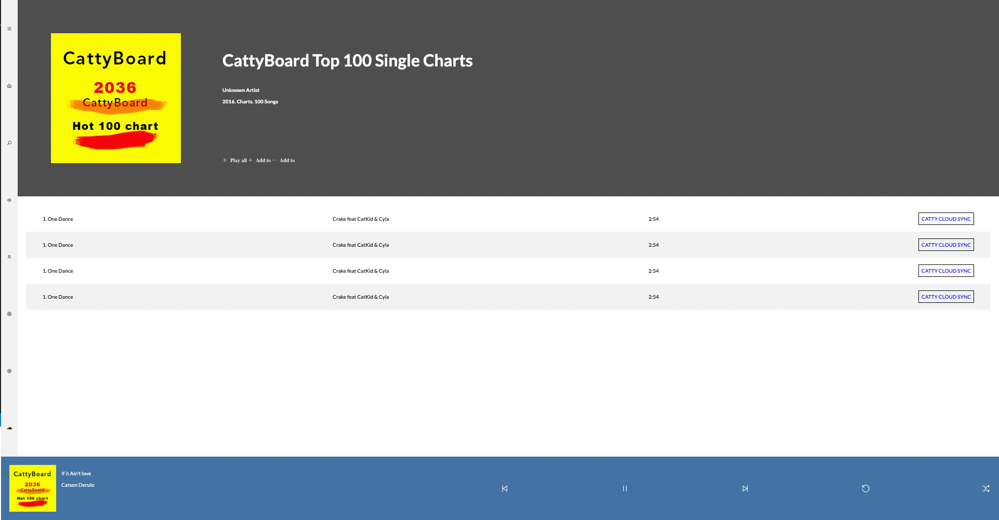

# Intructions

Create a Music player User Interface as shown in 👇 picture



## Resources
1. Use "Lato" font for entire text in UI
  ```
      <link
      href="https://fonts.googleapis.com/css2?family=Lato:wght@100;300;400;700;900&display=swap"
      rel="stylesheet"
    />
  ```
2. Use [line awesome](https://icons8.com/line-awesome) Icon library for all icons
  ```
      <link
      rel="stylesheet"
      href="https://cdnjs.cloudflare.com/ajax/libs/line-awesome/1.3.0/line-awesome/css/line-awesome.min.css"
      integrity="sha512-vebUliqxrVkBy3gucMhClmyQP9On/HAWQdKDXRaAlb/FKuTbxkjPKUyqVOxAcGwFDka79eTF+YXwfke1h3/wfg=="
      crossorigin="anonymous"
    />
  ```
3. Cattyboard album image URL: https://vif1g.csb.app/src/assets/cattyboard.jpg
4. Icons used in assignment:
   1. la-bars
   2. la-home
   3. la-search
   4. la-volume-up
   5. la-user
   6. la-cog
   7. la-spotify
   8. la-soundcloud
   9. la-play
   10. la-plus
   11. la-ellipsis-h
   12. la-step-backward
   13. la-step-forward
   14. la-undo-alt
   15. la-random


**Note: Feel free to use any other font library if you wish**
   
## Sample Demo app for reference  
  
[Sample Demo App](https://vif1g.csb.app/)


## Submission Instruction

Submission for the UI assignment will be done through codesandbox.io
Please watch 👇 to see how to create sandbox for UI assignments
[Code sandbox setup instructions](https://www.loom.com/share/6d93b7b3191146b8b97f34e813f5551e)
